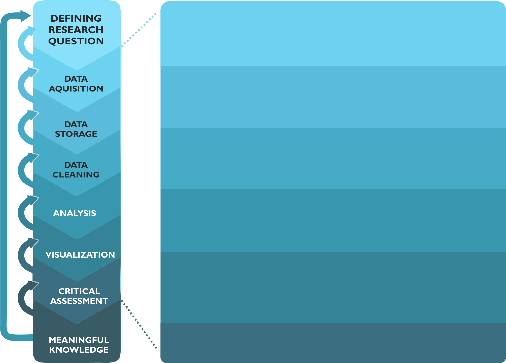

Introduction to Spatial Analytics
=================================

Learning goals
--------------

After this week's tutorial, you should be able to describe:

 - What are the typical analytical steps when doing spatial analytics?
 - What kind of analytical methods are available for working with spatial data?
 - Why it is important to document your workflow continuously when doing analyses?
 - What tools are available to make reproducible science and how to use them?

Resources
---------

 - literature
 - video

Analytical workflow
-------------------

Before diving into the world of spatial analytics, let's start by taking a look at the typical workflow that applies to
spatial data science (as well as to any kind of science, really). Figure 1 represents a typical workflow for doing spatial
analysis. During the course, these steps will become extremely familiar to you, as we are going to repeat the same basic
processing steps on each week.

   **Figure 1.** Typical spatial analysis workflow consist of various steps that start from defining the research question and (ideally)
   end with meaningful information about the topic that was analyzed. (adopted from :cite:`Toivonen2019`)

Step 1 - Defining the question/objectives
~~~~~~~~~~~~~~~~~~~~~~~~~~~~~~~~~~~~~~~~~

All analytical work (and doing science in general) starts by **defining the research question** and/or **specifying the objectives**
for the work. Typically this step starts by **getting an idea**. You most probably have gotten that "light bulb" 💡 moment, or been truly wondering
some aspect of life or technology that you don't yet understand. With the initial idea, typically follows a rigorous search for information
and discussing with others. In some cases, it turns out that no-one has yet answered to that question that you were wondering, or no-one has yet
developed a solution for the problem (e.g. a technical one) that you are facing. If this is the case,

.. bibliography:: references.bib
   :style: plain

.. raw:: html

    

|
