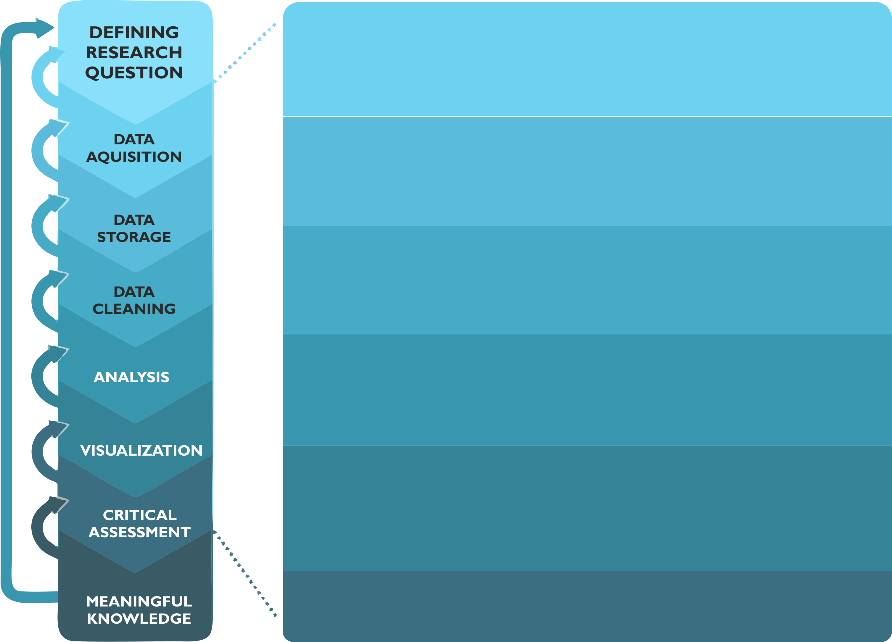
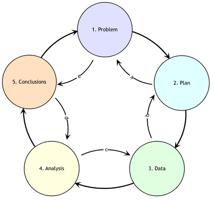

1. Introduction to Spatial Analytics
====================================

.. admonition:: Learning goals for this lesson
   :name: hint

   .. container:: toggle

        After this week's tutorial, you should be able to understand:

         - What is special about spatial?
         - What is the typical process workflow for doing spatial analysis?
         - Key definitions and their differences/similarities:
             - spatial analysis; GIS; geocomputation; GIScience; geographic data science; quantitative geography, ..
         - What are typical application areas for spatial analytics?
         - What kind of contemporary spatial data science challenges exist?

.. admonition:: Resources

   This week's literature and video material that you can go though on your own time.

   .. container:: toggle

        **Literature:**

         - M. de Smith, M. Goodchild, P. Longley (2020) - Geospatial Analysis (free online book):
            - `Chapter 3.1 - Analytical methodologies <https://www.spatialanalysisonline.com/HTML/index.html?analytical_methodologies.htm>`__
            - `Chapter 3.2 - Spatial analysis as a process <https://www.spatialanalysisonline.com/HTML/index.html?spatial_analysis_as_a_process.htm>`__
            - `Chapter 3.3 - Spatial analysis and the PPDAC model <https://www.spatialanalysisonline.com/HTML/index.html?spatial_analysis_and_the_ppdac.htm>`__

         - Singleton, A. & D. Arribas-Bel (2019) - `Geographic Data Science <https://onlinelibrary.wiley.com/doi/full/10.1111/gean.12194>`__ :cite:`Singleton2019`
         - Wolf L.J. et al. (2020) - `Quantitative geography III: Future challenges and challenging futures. <https://journals.sagepub.com/doi/10.1177/0309132520924722>`__ :cite:`Wolf2020`

        **Videos:**

        Spatial Data Science overview by Luc Anselin (2016):

        .. raw:: html

               <iframe width="560" height="315" src="https://www.youtube.com/embed/lawWM6jQYEE" frameborder="0" allow="accelerometer; autoplay; encrypted-media; gyroscope; picture-in-picture" allowfullscreen></iframe>

        What is spatial data science? (by CARTO):

         .. raw:: html

               <iframe width="560" height="315" src="https://www.youtube.com/embed/osAbJeTho5w" frameborder="0" allow="accelerometer; autoplay; encrypted-media; gyroscope; picture-in-picture" allowfullscreen></iframe>

What is special about spatial?
------------------------------

.. sidebar:: The first law of geography

        "everything is related to everything else, but near things are more related than distant things"

        -- Waldo Tobler (1970) :cite:`Tobler1970`

The question above is a classical discussion topic among spatial scientist and geographers, especially when
we are discussing with someone who comes outside of our domain (i.e. *great majority of the people*). For us, knowing why
geography matters is a rather obvious thing (as Waldo Tobler famously put it around 50 years ago),
but it is also good to remind us in a bit broader terms, what is it that make this field of ours special.
The following presentation gives you a brief introduction to the topic:

.. raw:: html

    <iframe src="https://docs.google.com/presentation/d/e/2PACX-1vS2xp3ydyopyxZOrCV336mnYWuIkE3wz2eEbXv5vH_O8ECBw0-pIpMQfpw8aegHHfllcbIbRF0xOe4j/embed?start=false&loop=false&delayms=3000" frameborder="0" width="700" height="420" allowfullscreen="true" mozallowfullscreen="true" webkitallowfullscreen="true"></iframe>

|

Analytical workflow
-------------------

Before diving into the world of spatial analytics, let's start by taking a look at the typical workflow that applies to
spatial data science (as well as to any kind of science, really). Figure 1 represents an overview of the typical workflow for spatial
analysis process (see more details from the following sections). During the course, these steps will become extremely familiar to you, as we are going to repeat the same
processing steps on each week.

   **Figure 1.** Typical spatial analysis workflow consist of various steps that start from defining the research question and (ideally)
   end with meaningful information about the topic that was analyzed. (adopted from :cite:`Toivonen2019`)

Another useful and a bit more generic analytical framework is to think the methodological work as a
sequence of 5 steps that is called as **PPDAC** :cite:`MacKay2000`:

   **Figure 2.**  A summary of a revised PPDAC approach as an iterative process: Although clockwise sequence (1→5) applies as
   the principal flow, each stage often feeds back to the previous stage. (Source: `de Smith et al. (2020) <https://www.spatialanalysisonline.com/HTML/index.html?analytical_methodologies.htm>`__ )

Step 1 - Defining the question/objectives
~~~~~~~~~~~~~~~~~~~~~~~~~~~~~~~~~~~~~~~~~

All analytical work (and doing science in general) starts by **defining the research question** and/or **specifying the objectives**
for the work. Typically this step starts by **getting an idea**. You most probably have gotten that "light bulb" 💡 moment, or been truly wondering
some aspect of life or technology that you don't yet understand. With the initial idea, typically follows a rigorous search for information
and discussing with others. In some cases, it turns out that no-one has yet answered to that question that you were wondering, or no-one has yet
developed a solution for the problem (e.g. a technical one) that you are facing. If this is the case,

Definitions: What is spatial analysis, really?
----------------------------------------------

*"A belowed child has many names"* ...

.. warning::

    No contents here (this is just a demo). This part would introduce the students what is meant by:

        - spatial analytics
        - GIS
        - geocomputation
        - GIScience / spatial data science / geographic data science
        - geoinformatics / geoinformation technology
        - quantitative geography

    Focus is to understand some of the historical reasons, debates and reasoning why all of these different domains
    have emerged and how they differ from each other.

Application areas for spatial analysis
--------------------------------------

.. warning::

    No contents here (this is just a demo). This part would introduce the students what kind of application areas
    and spatial analysis methods there exists.

Contemporary challenges in spatial data science
-----------------------------------------------

.. warning::

    No contents here (this is just a demo). This part would introduce the students what kind of contemporary challenges exist
    for spatial data science, such as:

        - how to handle ever growing and massive spatial datasets (big geodata)
        - how to handle sensitive spatial data in such a manner that it does not violate privacy (e.g. movement data, geosocial data etc.)
        - how to utilize modern machine learning frameworks (such as neural nets) with spatial data to make e.g. more accurate models and predictions
        - + classical issues:
            - how to deal with uncertainty in spatial data
            - how to democratize spatial analysis (e.g. with online spatial analysis platforms)

References
----------

.. bibliography:: references.bib
   :style: plain

.. raw:: html

    

|
