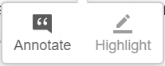

|

Welcome to **Introduction to Spatial Analytics** -course that provides the theories, tools, and methods that
an engineer and a modern spatial data scientist needs to meet the challenges of contemporary data science applied to
geographic problems and data.

Learning goals
--------------

After this course, you should have basic knowledge and skills to apply spatial analysis

Prerequisites
-------------

Before taking this course, it is required to know the basics of Python programming as well as GIS.
If you are new to Python, or would like to refresh your Python skills, we recommend that
you start with an online and open access course called **Geo-Python** which is available at
`geo-python.github.io <https://geo-python.github.io>`__ (includes tutorials, videos, exercises).

Course topics by week
---------------------

In this course, we dive into theories and methods of Spatial Data Analytics using python programming language.
This part of the course runs for seven weeks starting on Monday the 7th of September 2020.

Lesson materials are published on these pages each week on Monday,
after which they are publicly available for anyone interested:

.. list-table::
    :widths: 5 50
    :header-rows: 1
    :stub-columns: 1

    * - Week
      - Theme
    * - 1
      - Introduction to spatial analytics (workflow + overview of common methodologies)
    * - 2
      - Spatial data aquisition, cleaning, filtering, and classification.
    * - 3
      - Point pattern analysis and clustering
    * - 4
      - Spatial autocorrelation and LISA
    * - 5
      - Spatial interpolation (IDW and Kriging)
    * - 6
      - Spatial network analysis
    * - 7
      - Spatial regression
    * - 8
      - Applying spatial analytics in the Era of Big Data

Course online tools
-------------------

.. admonition:: THIS IS JUST A DEMO!
    :name: danger

    **NOTE**: This page does not contain a full course. The purpose of this website is to demonstrate how Henrikki
    would be teaching the course using modern online teaching technologies.

.. admonition:: Make notes and highlight text on browser!
    :name: warning

    This course site offers you the possibility to make notes and highlight the important pieces of text from the
    materials, just like you would do with printed course materials (well almost..). You can access these features
    by creating an account at `Hypothes.is <https://hypothes.is/signup>`__ and login in from the upper right corner
    of this website by pressing |hypothesisbutton| button. After login in, you can create a note or highligh text simply
    by 1) **selecting the text that you wish to mark** and 2) **choosing from the following button** |hypothesischoose|
    whether you want to make a note or highlight the text. These notes and highlighted text will always be available for
    you when you come back to the materials and login to Hypothes.is.

.. admonition:: Repeat and run all the examples directly on your browser!
    :name: important

    The materials are written in a way that you can follow them step by step exactly as they are written
    and test all the codes. We provide you cloud computing resources that you can use to run the codes using an `IDE <https://en.wikipedia.org/wiki/Integrated_development_environment>`__
    using `Binder <https://mybinder.readthedocs.io/en/latest/>`__ and `CSC Finland <https://www.csc.fi/>`__ cloud computing resources (for Finnish students).
    If you work from your own computer, **you need to adjust the file paths to the data** accordingly.

.. admonition:: Open Access!
    :name: hint

    The course is **open for everyone**. The aim of this course is to share the knowledge and help people to get
    started with their journey for doing spatial analytics more efficiently and in a reproducible manner
    using Python programming.

.. |hypothesisbutton| image:: _static/hypothesis_button.PNG
    :scale: 50 %

.. toctree::
   :maxdepth: 2
   :hidden:

   course_information
   analysis_workflow
   notebooks/data_aquisition
   notebooks/point_pattern_analysis
   notebooks/spatial_autocorrelation
   notebooks/spatial_interpolation
   notebooks/spatial_network_analysis_src
   notebooks/spatial_regression

.. raw:: html

    

|
