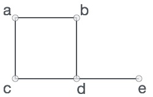

6. Spatial Network analysis
===========================

.. image:: https://img.shields.io/badge/Interact-Run%20the%20codes%20in%20browser-orange.svg
    :target: https://mybinder.org/v2/gh/HTenkanen/AISA/master?urlpath=lab/tree/sources/notebooks/spatial_network_analysis.ipynb

|

Introduction
------------

**Networks are everywhere**. Social networks, telecommunication networks, neural networks, and transportation networks
are all familiar examples how the networks surround us and are very essential to our everyday life. No surprise then,
that studying complex networks has grown to be a very important topic in various fields of science including biology, medical sciences,
social science, engineering, geography and many others.

*Examples of different kind of networks:*

.. raw:: html

    <iframe src="https://docs.google.com/presentation/d/e/2PACX-1vQa8mUSXktDN0-PN22ohMps6oTxfLHLjly6ewhvcAAJm37dO9NNW8BHVy4oMe8sKIorNWOZJLM5dVf7/embed?start=false&loop=false&delayms=3000" frameborder="0" width="700" height="420" allowfullscreen="true" mozallowfullscreen="true" webkitallowfullscreen="true"></iframe>

|
Today we will focus on **spatial networks** and learn different methods for analyzing
spatial networks and conduct useful queries such as finding the shortest path along a street network.

.. admonition:: Learning goals
   :name: hint

   .. container:: toggle

        After this tutorial, you should be able to:

         - Understand typical application areas for spatial network analysis
         - Know the basic concepts and elements of a graph (network)
         - Be able to solve simple spatial network analysis problems using Python programming language

.. admonition:: Additional materials
   :name: hint

   .. container:: toggle

        **Literature**

         - De Smith, Goodchild, Longley et al. (2020). Geospatial Analysis - `Chapter 7: Network and Location Analysis <https://www.spatialanalysisonline.com/HTML/index.html?network_and_location_analysis.htm>`__

        **Videos**

        .. raw:: html

            <iframe width="560" height="315" src="https://www.youtube.com/embed/ZHr0Ch6KRSM" frameborder="0" allow="accelerometer; autoplay; encrypted-media; gyroscope; picture-in-picture" allowfullscreen></iframe>

.. admonition:: Exercise 6
   :name: hint

   .. container:: toggle

        In Exercise 6, you will practice how to work with OpenStreetMap data and conduct network analysis in Python.
        The practical programming sessions will be organized again on Thursday where you can get help from the course assistants.

        You can start working on your copy of Exercise 6 by `accepting the GitHub Classroom assignment <https://classroom.github.com/a/8LP9voLx>`__.

Before we dive deeper to spatial networks, **let's spend a moment with the following task**:

.. admonition:: Discuss with your neighbor (3 minutes)
   :name: important

   **TASK 1:** Think practical examples where spatial network analysis algorithms are used in daily operations of the society?

    .. container:: toggle

        .. admonition:: 1. Navigation

            Show me the best route from A to B:

                - Car navigation
                - Journey planning (public transport)
                - Emergency way-finding etc.

            .. figure:: img/navigator.gif

                *Source: Sygic Ltd* (`2020 <https://www.sygic.com/blog/2017/introducing-new-gps-navigation-feature-real-view-navigation>`__)

        .. admonition:: 2. Spatial planning

              - Where should we locate a new service?
              - Where traffic congestion is most likely going to worsen in the future? (simulations)
              - How many people can reach this location within X minutes?

            .. figure:: img/travel_time_isochrones.gif

                *How fast do you reach different parts of the city by different travel modes? (pink: private car, yellow: bicycle, green: public transport) Source: Topi Tjukanov* (`2018 <https://tjukanov.org/accessibility-fireworks>`__)

        .. admonition:: 3. Spatial economics

                - Forecasting economic developments in the area
                - How many more customers/revenue this shop is going to get when the new metro-line opens?
                - Spatial interaction models (e.g. gravity models such as Huff's)

            .. figure:: img/Huffs_model.jpg

                 *Source Ela Dramowicz* (`2015 <https://www.directionsmag.com/article/3207>`__)

Tutorial
--------

Finding a shortest path using a specific street network is a common spatial analytics
problem that has many practical every-day applications.

**How to do network analysis in practice? What tools to use?** Luckily, Python provides easy to use tools for conducting spatial network analysis.
One of the easiest ways to start is to use a library
called `Networkx <https://networkx.github.io/documentation/stable/>`__
which is a Python module that provides a lot tools that can be used to
analyze networks on various different ways. It also contains algorithms
such as `Dijkstra’s
algorithm <https://networkx.github.io/documentation/networkx-1.10/reference/generated/networkx.algorithms.shortest_paths.weighted.single_source_dijkstra.html#networkx.algorithms.shortest_paths.weighted.single_source_dijkstra>`__
or
`A\* <https://networkx.github.io/documentation/networkx-1.10/reference/generated/networkx.algorithms.shortest_paths.astar.astar_path.html#networkx.algorithms.shortest_paths.astar.astar_path>`__
algoritm that are commonly used to find shortest paths along
transportation network.

Next, we will learn how to do spatial network analysis in practice.

What is a graph?
----------------

Before continuing, it is good to understand some basic things about a
**graph** that is the underlying data structure used when conducting
routing.

Graphs are, in principle, very simple data structures, and they consists
of:

1. **nodes** (e.g. intersections on a street, or a person in social
   network), and
2. **edges** (a link that connects the nodes to each other)

A simple graph could look like this:

   A simple graph.

Here, the letters ``A, B, C, D, and E`` are nodes and the lines that
goes between them are edges/links.

Node and Edge attributes
~~~~~~~~~~~~~~~~~~~~~~~~

In terms of street networks, nodes typically contain the geographical
information associated with the graph (i.e. coordinates of the
intersection). Edges typically contain much more information. They
e.g. contain information about **which nodes are connected to each
other**, and what is the **cost** to travel between the nodes
(e.g. time, distance, CO2, etc.). It is also possible to associate
geographical information to edges (if you e.g. want to show how the
roads are curved between intersections), but for basic travel time
analyses this is not needed.

ADD IMAGE OF GRAPH WITH COSTS.

Directed vs Undirected graphs
~~~~~~~~~~~~~~~~~~~~~~~~~~~~~

Graph can be **directed** or **undirected**, which basically determines
whether the roads can be travelled to any direction or whether the
travel direction is restricted to certain direction (e.g. a
one-way-street).

In **undirected** graph, it is possible to travel in both directions
between nodes (e.g. from ``A --> B`` and from ``B --> A``). Undirected
graphs are typically used e.g. with walking and cycling as with those
travel modes it is typically possible to travel the same street in any
direction you like.

ADD IMAGE OF DIRECTED GRAPH.

If the graph is **directed**, it means that you should have a separate
edge for each direction. If you for example have a graph with only an
edge that goes from ``D`` to ``E``, you can travel to node ``E`` from
``D`` but you cannot travel back. In directed graphs, **you need to have
a separate edge for each travel direction**. Fundamentally this means
that for a bi-directional road, you should have edges in your data
(i.e. two separate rows), such as:

======= ========= ======= ======================
edge_id from_node to_node description
======= ========= ======= ======================
1       D         E       *edge for direction 1*
2       E         D       *edge for direction 2*
======= ========= ======= ======================

.. admonition:: TASK 2 - Vote!
   :name: note

   The following routes are examples of paths with costs along the network. Which one is faster? Choose A or B.
   (press **+** to open the questionnaire)

    .. container:: toggle

        .. admonition:: Questions (open in full screen if difficult to see)

            .. raw:: html

               <iframe src="https://docs.google.com/presentation/d/e/2PACX-1vQa8mUSXktDN0-PN22ohMps6oTxfLHLjly6ewhvcAAJm37dO9NNW8BHVy4oMe8sKIorNWOZJLM5dVf7/embed?start=false&loop=false&delayms=3000" frameborder="0" width="550" height="350" allowfullscreen="true" mozallowfullscreen="true" webkitallowfullscreen="true"></iframe>

Next, we will continue, and see how to conduct shortest path analysis by walking/cycling using Python.

Typical workflow for spatial network analysis
---------------------------------------------

If you want to conduct network analysis (in any programming language)
there are a few basic steps that needs to be done before you can start
routing (**remember the workflow that we learned during the first lesson**).

These steps are:

1. **Retrieve data** (such as street network from OSM or Digiroad +
   possibly transit data if routing with PT).
2. (Possibly modify the network by applying custom edge weights
   considering e.g. traffic conditions for car).
3. **Build a routable graph** for the routing tool that you are using
   (e.g. NetworkX, Igraph or OpenTripPlanner).
4. **Conduct network analysis** (such as shortest path analysis) with
   the routing tool of your choice.
5. **Visualize the results** (e.g. the shortest paths on the map, or isochrones)

Network analysis by walking / cycling
-------------------------------------

1. Retrieve data
----------------

As a first step, we need to obtain data for routing.
`OSMnx <https://github.com/gboeing/osmnx>`__ library makes it really
easy to retrieve routable networks from OpenStreetMap with different
transport modes (walking, cycling and driving). Osmnx also combines some
functionalities from ``networkx`` module to make it straightforward to
conduct routing along OpenStreetMap data.

-  Let’s first download the OSM data from Kamppi that are walkable. In
   OSMnx, we can use a function called ``.graph_from_place()`` which
   retrieves data from OpenStreetMap. It is possible to specify what
   kind of roads should be retrieved from OSM with ``network_type``
   -parameter.

.. jupyter-execute::
    :raises:

    import osmnx as ox
    import geopandas as gpd
    import networkx as nx
    from shapely.geometry import Point

    # The place where you want to retrieve the data
    # OSMnx uses Nominatim/OverPass API to retrieve the data
    # You can check that your place name is valid from: https://nominatim.openstreetmap.org/
    place = "Kamppi, Helsinki, Finland"

    # Retrieve pedestrian data
    kamppi = ox.gdf_from_place(place)
    G = ox.graph_from_place(place, network_type='walk')

    # What did we retrieve?
    G

Okay, so as we can see the ``OSMnx`` library fetched some data and
returned us a ``MultiDiGraph`` object.

Let’s see what the data looks like:

.. jupyter-execute::
    :raises:

    fig, ax = ox.plot_graph(G)

As we can see, now we have fetched walkable streets from Kamppi. In the
figure, the lines are streets and all the nodes are represented with
light blue color.

**How does the actual data look like?**

There are a couple of ways to access the edge and node attributes. The
easier way is to use an OSMnx function ``graph_to_gdfs()`` that returns
the nodes and edges as GeoDataFrames. The other option to access the
data is via the graph itself by looping through nodes and edges as
follow: - ``for node_id, node in G.nodes(data=True)`` -
``for fr, to, edge in G.edges(data=True)``

Often you want to manipulate nodes and edges somehow. Hence, often it is
useful to fetch the data into GeoDataFrames:

.. jupyter-execute::
    :raises:

    nodes, edges = ox.graph_to_gdfs(G, nodes=True, edges=True)  # you can flag whether you want to e.g. exclude nodes

.. jupyter-execute::
    :raises:

    # Check the first rows of the nodes
    nodes.head()

.. jupyter-execute::
    :raises:

    # First rows of the edges
    edges.head()

As we can see from this edge-table, we have a lot of information. For
routing purposes, the most useful attributes are ``length`` (in meters)
and ``maxspeed`` (for car routing) which we can use to calculate travel
times.

2. Modify the graph
-------------------

Let’s next modify the data in our graph, so that we can conduct the
shortest path search based on travel time.

In this case, we specify that the **walking speed is a static 4.5 kmph**
and **cycling speed is 19 kmph**. We will calculate the cost of travel
(time) for each road segment (i.e. edge) into a new column ``walk_t``
that we can later use as a weight variable in routing (also known as
impedance or cost).

.. jupyter-execute::
    :raises:

    # Calculate the time (in seconds) it takes to walk through road segments
    walk_speed = 4.5  # kmph
    edges['walk_t'] = (( edges['length'] / (walk_speed*1000) ) * 60 * 60).round(1)

    # Do the same for cycling
    cycling_speed = 19  # kmph
    edges['bike_t'] = (( edges['length'] / (cycling_speed*1000) ) * 60 * 60).round(1)

    # Let's check what we got
    edges[['length', 'walk_t', 'bike_t']].head()

3. Build graph
--------------

Now as we have calculated the travel time for our edges. We still need
to convert our nodes and edges back to a NetworkX graph, so that we can
start using it for routing. When using OSM data fetched with OSMnx this
can be done easily with function ``ox.gdfs_to_graph()``. Notice that
this **only works when using OSMnx library**, we will later see in
detail how the graphs are built from scratch which enables you to
customize them.

-  Let’s build the graph with OSMnx:

.. jupyter-execute::
    :raises:

    G = ox.gdfs_to_graph(gdf_nodes=nodes, gdf_edges=edges)
    type(G)

Okay, now we have converted our data back into a NetworkX graph. Let’s
ensure that our new edge attribute really exists:

.. jupyter-execute::
    :raises:

    # Check only the first row from edges
    for fr, to, edge in G.edges(data=True):
        print(edge)
        break

Great, as we can see now we have a new edge attribute in our graph that
we can use for routing.

4. Routing with NetworkX
------------------------

Now we have everything we need to start routing with NetworkX (by
walking and cycling). But first, let’s again go through some basics
about routing.

Basic logic in routing
~~~~~~~~~~~~~~~~~~~~~~

Most (if not all) routing algorithms work more or less in a similar
manner. The basic steps for finding an optimal route from A to B, is to:
1. Find the nearest node for origin location \* (+ get info about its
node-id and distance between origin and node) 2. Find the nearest node
for destination location \* (+ get info about its node-id and distance
between origin and node) 3. Use a routing algorithm to find the shortest
path between A and B 4. Retrieve edge attributes for the given route(s)
and summarize them (can be distance, time, CO2, or whatever)

\* in more advanced implementations you might search for the closest
edge

This same logic should be applied always when searching for an optimal
route between a single origin to a single destination, or when
calculating one-to-many -type of routing queries (producing e.g. travel
time matrices).

Find the optimal route between two locations
~~~~~~~~~~~~~~~~~~~~~~~~~~~~~~~~~~~~~~~~~~~~

Next, we will learn how to find the shortest path between two locations
using
`Dijkstra’s <https://en.wikipedia.org/wiki/Dijkstra%27s_algorithm>`__
algorithm.

First, let’s find the closest nodes for two locations that are located
in the area. OSMnx provides a handly function for geocoding an address
``ox.geocode()``. We can use that to retrieve the x and y coordinates of
our origin and destination.

.. jupyter-execute::
    :raises:

    # OSM data is in WGS84 so typically we need to use lat/lon coordinates when searching for the closest node

    # Origin
    orig_address = "Kalevankatu 16, Helsinki"
    orig_y, orig_x = ox.geocode(orig_address)  # notice the coordinate order (y, x)!

    # Destination
    dest_address = "Ruoholahdenkatu 24, Helsinki"
    dest_y, dest_x = ox.geocode(dest_address)

    print("Origin coords:", orig_x, orig_y)
    print("Destination coords:", dest_x, dest_y)

Okay, now we have coordinates for our origin and destination.

Find the nearest nodes
~~~~~~~~~~~~~~~~~~~~~~

Next, we need to find the closest nodes from the graph for both of our
locations. For calculating the closest point we use here ``'haversine'``
formula to get the distance in meters (with ``return_dist=True``).

.. jupyter-execute::
    :raises:

    # 1. Find the closest nodes for origin and destination
    orig_node_id, dist_to_orig = ox.get_nearest_node(G, point=(orig_y, orig_x), method='haversine', return_dist=True)
    dest_node_id, dist_to_dest = ox.get_nearest_node(G, point=(dest_y, dest_x), method='haversine', return_dist=True)

    print("Origin node-id:", orig_node_id, "and distance:", dist_to_orig, "meters.")
    print("Destination node-id:", dest_node_id, "and distance:", dist_to_dest, "meters.")

Now we are ready to start the actual routing with NetworkX.

Find the fastest route by walking / cycling
~~~~~~~~~~~~~~~~~~~~~~~~~~~~~~~~~~~~~~~~~~~

Now we can do the routing and find the shortest path between the origin
and target locations by using the ``dijkstra_path()`` function of
NetworkX. For getting only the cumulative cost of the trip, we can
directly use a function ``dijkstra_path_length()`` that returns the
travel time without the actual path.

With ``weight`` -parameter we can specify the attribute that we want to
use as cost/impedance. We have now three possible weight attributes
available: ``'length'``, ``'walk_t'`` and ``'bike_t'``.

-  Let’s first calculate the routes between locations by walking and
   cycling, and also retrieve the travel times

.. jupyter-execute::
    :raises:

    import networkx as nx
    # Calculate the paths by walking and cycling
    walk_path = nx.dijkstra_path(G, source=orig_node_id, target=dest_node_id, weight='walk_t')
    bike_path = nx.dijkstra_path(G, source=orig_node_id, target=dest_node_id, weight='bike_t')

    # Get also the actual travel times (summarize)
    walk_t = nx.dijkstra_path_length(G, source=orig_node_id, target=dest_node_id, weight='walk_t')
    bike_t = nx.dijkstra_path_length(G, source=orig_node_id, target=dest_node_id, weight='bike_t')

Okay, that was it! Let’s now see what we got as results by visualizing
the results.

5. Visualize the results
------------------------

For visualization purposes, we can use a handy function again from OSMnx
called ``ox.plot_graph_route()`` (for static) or
``ox.plot_route_folium()`` (for interactive plot).

-  Let’s first make static maps

.. jupyter-execute::
    :raises:

    # Walking
    fig, ax = ox.plot_graph_route(G, walk_path)

    # Add the travel time as title
    ax.set_xlabel("Walk time {t: .1f} minutes.".format(t=walk_t/60))

.. jupyter-execute::
    :raises:

    # Cycling
    fig, ax = ox.plot_graph_route(G, bike_path)

    # Add the travel time as title
    ax.set_xlabel("Cycling time {t: .1f} minutes.".format(t=bike_t/60))

Great! Now we have successfully found the optimal route between our
origin and destination and we also have estimates about the travel time
that it takes to travel between the locations by walking and cycling. As
we can see, the route for both travel modes is exactly the same which is
natural, as the only thing that changed here was the constant travel
speed.

-  Let’s still finally see an example how you can plot a nice
   interactive map out of our results with OSMnx:

.. jupyter-execute::
    :raises:

    ox.plot_route_folium(G, walk_path, popup_attribute='walk_t')

Calculate travel times from one to many locations
-------------------------------------------------

When trying to understand the accessibility of a specific location, you
typically want to look at travel times between multiple locations
(one-to-many) or use isochrones (travel time contours).

-  Let’s see how we can calculate travel times from the origin node, to
   all other nodes in our graph using NetworkX function
   ``single_source_dijkstra_path_length()``:

.. jupyter-execute::
    :raises:

    # Calculate walk travel times originating from one location
    walk_times = nx.single_source_dijkstra_path_length(G, source=orig_node_id, weight='walk_t')

.. code:: ipython3

    # What did we get?
    walk_times

    {298372995: 0,
     310042886: 4.3,
     298372997: 4.8,
     1377211668: 9.1,
     298372992: 10.1,
     298372994: 10.5,
     298372999: 14.6,
     298373001: 15.0,
     298275980: 20.4,
     1008235033: 58.6,
     298275990: 61.6,
     298275993: 63.1,
    ...
    }

As we can see, the result is a dictionary where we have the **node_id**
as keys and the **travel time** as values.

For visualizing this information, we need to join this data with the
nodes. For doing this, we can first convert the result to DataFrame and
then we can easily merge the information with the nodes GeoDataFrame.

.. jupyter-execute::
    :raises:

    import pandas as pd
    # Convert to DataFrame and add column names
    walk_times_df = pd.DataFrame([list(walk_times.keys()), list(walk_times.values())]).T
    walk_times_df.columns = ['node_id', 'walk_t']

    # What do we have now?
    walk_times_df.head()

Great! Now we have the travel times **from origin** to all other nodes
in the graph.

-  Let’s finally merge the data with the nodes GeoDataFrame and
   visualize the results

.. jupyter-execute::
    :raises:

    # Check the nodes
    nodes.head()

As we can see, the ``node_id`` in the nodes GeoDataFrame can be found
from the ``index`` of the gdf as well as from the column ``osmid``.

-  Let’s merge these two datasets:

.. jupyter-execute::
    :raises:

    # Merge the datasets
    nodes = nodes.merge(walk_times_df, left_on='osmid', right_on='node_id')

    # Check
    nodes.head()

Okay, now we have also the travel times associated for each node.

-  Let’s visualize this:

.. jupyter-execute::
    :raises:

    %matplotlib inline

    # Make a GeoDataFrame for the origin point so that we can visualize it
    orig = gpd.GeoDataFrame({'geometry': [Point(orig_x, orig_y)]}, index=[0], crs={'init': 'epsg:4326'})

    # Plot the results with edges and the origin point (green)
    ax = edges.plot(lw=0.5, color='gray', zorder=0, figsize=(10,10))
    ax = nodes.plot('walk_t', ax=ax, cmap='RdYlBu', scheme='natural_breaks', k=5, markersize=30, legend=True)
    ax = orig.plot(ax=ax, markersize=100, color='green')

    # Adjust axis
    ax.set_xlim([24.92, 24.945])
    ax.set_ylim([60.160, 60.170])

Okay, as we can see now we have quickly calculated the travel times for
each node in the graph using a single call.

If you would have for example a predefined grid, you could find the
nearest node for each grid centroid to produce a more matrix-like
result.

Alternative approach - Ego graph
~~~~~~~~~~~~~~~~~~~~~~~~~~~~~~~~

Alternatively, it is possible to directly set a specific time limit and
restrict **how long the graph is travelled** from the origin, and return
that subgraph for the user.

-  Let’s see an example:

.. jupyter-execute::
    :raises:

    # Take a subgraph until 4 minutes by walking (240 seconds)
    subgraph = nx.ego_graph(G, n=orig_node_id, radius=240, distance='walk_t')
    fig, ax = ox.plot_graph(subgraph)

As we can see, with this approach we can retrieve a partial graph that
we could for example visualize with different colors, or e.g. subset the
extent of our accessibility analysis to cover only specific range from
the source.

.. raw:: html

    
